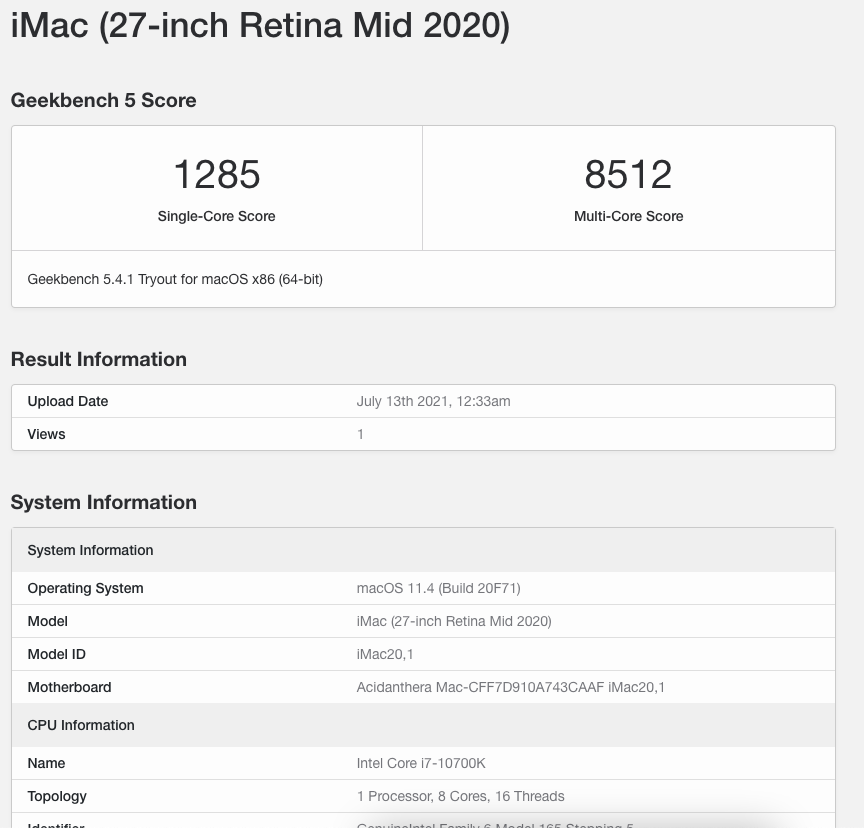

# Hackintosh Intel i7 10700k ASUS ROG STRIX Z490-G GAMING WIFI

## Configuration

### Hardware

| Device      | Model                                    |
| ----------- | ---------------------------------------- |
| CPU         | Intel Core i7-10700K                     |
| Motherboard | ASUS ROG STRIX Z490-G GAMING WIFI        |
| RAM         | Corsair Vengeance RGB Pro 8GB X 2 3200Hz |
| GPU         | Nitro+ RX 5500 XT 8G                     |
| Case        | NZXT H510                                |
| Cooler      | NOCTUA NH-D15 Chromax Black              |
| PSU         | Corsair RM Series RM750 - 750W           |
| Monitors    | Dell P2419H - LG 27GL850                 |

### Software

- Bootloader: OpenCore 0.7.1
- OS: macOS Big Sur 11.4

OpenCore setup was made according to https://dortania.github.io/OpenCore-Install-Guide/

### BIOS settings

**Note:** some settings are different from OpenCore guide.

#### Disable

- Fast Boot
- Serial/COM port
- Intel SGX
- Secure Boot
- VT-d (can be enabled if you set DisableIoMapper to YES)
- CSM

#### Enable

- VT-x
- Above 4G decoding
- Hyper-Threading
- EHCI/XHCI Hand-off
- OS type
- SATA Mode: AHCI
- IGPU Memory: 64MB

#### Set

- Secure Boot: set OS type to Other OS

#### Leave as is

- CFG lock: no such option, already unlocked

### Working

- [x] CPU/Motnerboard
- [x] Integrated graphics Intel UHD 630 (HDMI - Displayport)
- [x] Audio Realtek
- [x] Intel i225-V Ethernet
- [x] WIFI 6 AX201 Internal
- [x] Shutdown/restart
- [x] Sleep/wake
- [x] USB
- [x] Power management
- [x] IOS Simmulator
- [x] Bluetooth
- [x] 1x DisplayPort for Output with 2k Monitor
- [x] 1x HDMI for Output with FullHD Monitor

### Issues

- Unstable Wi-Fi, sometimes can not connect or show list networks

### Benchmark

